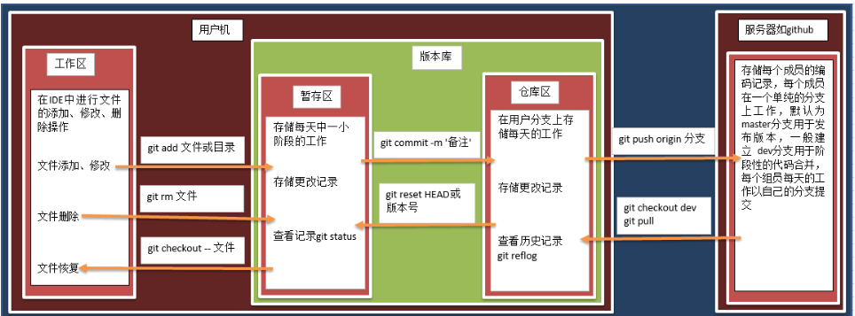
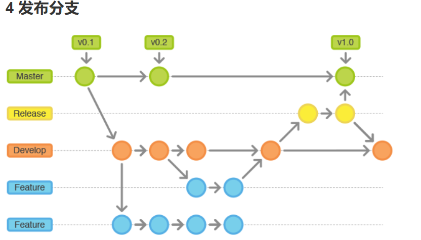

git代码管理: 

​     gitlab  [gi leen] 

比如权限设置。一般企业内部软件产品用gitlab是更好的选择，如果是开源产品，一般放在github上。

码云（https://gitee.com/enterprises?from=tg-6-7）是开源中国社区推出的基于git的代码托管服务平台，基于gitlab。目前招商银行，中国科学技术大学，CSDN等多家企业和机构都在使用码云平台。

https://blog.csdn.net/weishinexk/article/details/51454167  教程:

git:

**介绍:**

git 是 一款开源的分布式版本控制工具:在每个客户端都有一份完整的代码仓库, 可以在每个客户端自行管理

svn 是一款集中式版本控制工具,:所有的代码集中一块, 统一进行管理.

**优缺:**

1.SVN使用分支比较笨拙，git可以轻松拥有无限个分支

2.SVN必须联网才能正常工作，git支持本地版本控制工作

分布式和集中式最大的区别在于：在分布式下，本地有个代码仓库,开发者可以在本地提交; 而集中式版本控制, 只有在服务器才有一个代码仓库, 只能在服务器进行统一管理

**一般的使用步骤:**

git  init  初始化的你git 文件夹

git config user.name “manager”

git config user.email “[manager@qq.com](/Users/liujing/Library/Application Support/typora-user-images/A14CCF90-54EC-404F-B739-B39CB207A71A/mailto:manager@qq.com)”

git clone   本地代码的仓库地址

git status 查当前文件的状态

​    红色表示新建文件或者新修改的文件,都在工作区.

​    绿色表示文件在暂存区

​    新建的login.py文件在工作区，需要添加到暂存区并提交到仓库区

(工作区=(git add . )>版本库(暂存区=(git commit -m “创建person.h”)>仓库区)=(git push)>server/github)

git commit -am "版本描述"   :  add  与 commit 的合体

git push  不带任何参数的git push，默认只推送当前分支

git pull   

git branch    查看分支

git checkout (tag的名字,在哪个版本上建个分支)-b lucklvbai

合并完成后,可以删除共享库的分支:git branch -r -d origin/v1.0fixbug

查看版本标签: git tag

查看历史版本:  git  log /relog

**经理:**  

git tag -a 标签名 -m '标签描述':　git tag -a v1.0 -m 'version 1.0'

git tag -a v1.0 -m 'version 1.0':　git tag -a v1.0 -m 'version 1.0'

**合并：**

git checkout master

git merge dev

git push

**分支：**　区分生产环境代码以及开发环境代码

git checkout -b dev  (新建分支)

git checkout  dev  (切换分支)

git push -u origin dev   (将分支推送到远程)

如果代码冲突的话:　

​    原因：多人同时修改了同一个文件

​    养成良好的操作习惯,先pull在修改,修改完立即commit和push

​     对比代码:git diff origin/dev 

​     获取最新代码 :git fetch 

\> 告诉git你是谁？

​        原因: 追踪修改记录

​        命令: git config user.name “shunzi”

​    \> 告诉git怎样联系你？

​        原因: 多人合作开发时, 沟通交流

​        命令: git config user.email "[shunzi@qq.com](/Users/liujing/Library/Application Support/typora-user-images/A14CCF90-54EC-404F-B739-B39CB207A71A/mailto:shunzi@qq.com)"

​    \> 查看配置信息（.git -> config打开）

​        命令:  git config -l

答题流程 :  1.config 2. 增删改查 3. 创建分支

**工作流分支:** 

​        每个新功能位于一个自己的分支，这样可以push到中央仓库以备份和协作。 但功能分支不是从master分支上拉出新分支，而是使用develop分支作为父分支。当新功能完成时，合并回develop分支。 新功能提交应该从不直接与master分支交互。

用于新建发布分支的分支: develop

用于合并的分支: master

分支命名: release-* 或 release/*

| **分支** | **作用**                   |
| -------- | -------------------------- |
| master   | 迭代历史分支               |
| dev      | 集成最新开发特性的活跃分支 |
| f_xxx    | feature 功能特性开发分支   |
| b_xxx    | bug修复分支                |
| r_xxx    | release 版本发包分支       |

**在服务器中查看日志文件的方法：**

tail flask.log # 查看最后一条记录

tail -n 100 flask.log # 查看最新的100条记录

tail -f flask.log # 实时查看